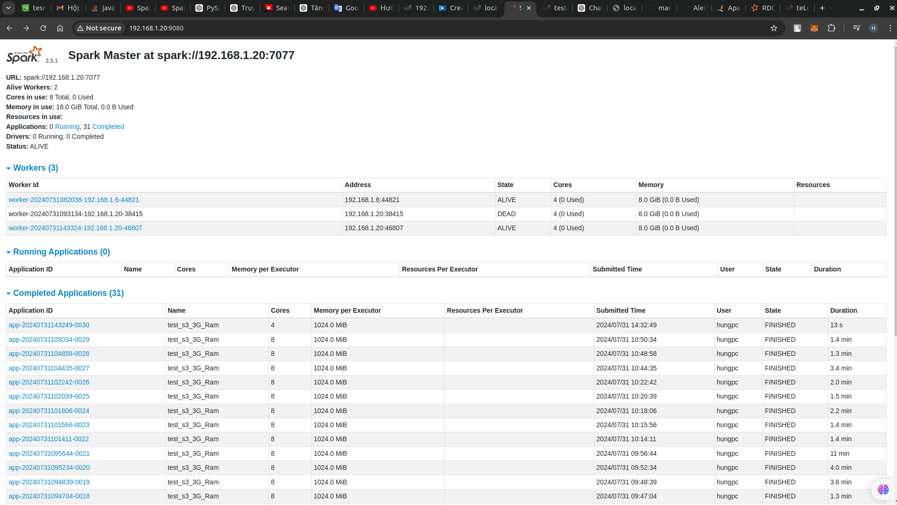

# Prerequisite
Using basic:
-  Python
-  linux

# PySpark-for-Beginner-ETL

! This project is built using Linux operating system (ubuntu 22.04)

This article will not go into the definition of specific transformations and actions but will only discuss the operating principles and optimization principles of Spark.

This document is designed to be read in parallel with the code in the `PySpark-for-Beginner-ETL` repository. Together, these constitute what we consider to be a 'best practices' approach to writing ETL jobs using Apache Spark and its Python ('PySpark') APIs. This project addresses the following topics:

- set up environment, var environment;
- Spark architechture;
- Resilient Distributed Datasets(RDD), Data Frame(DF), Spark SQL;
- How spark work :
  - Spark operators
  - cluster, worker node, driver node, executor, partition, task, stage;
- Code example and spark UI;
- Spark performance optimization methods;


## Set up environment, var environment

Install java 11
```sh
sudo apt-get install openjdk-11-jdk
```

Install python 3.10
```sh
sudo apt install python3.10
```

Install spark (should install the full version of spark to use it, the version you install with `pip install pyspark` will be difficult to understand). After downloaded, install it
```sh
wget https://dlcdn.apache.org/spark/spark-3.5.1/spark-3.5.1-bin-hadoop3.tgz
tar -xzvf spark-3.5.1-bin-hadoop3.tgz
```

Set up variable environment, open file .bashrc by 
```sh
# open file
nano ~/.bashrc

# save config
source ~/.bashrc
```

and add
```sh
export SPARK_HOME=/path/to/spark
export PATH=$PATH:$SPARK_HOME/bin
```


## Resilient Distributed Datasets(RDD), Data Frame(DF), Spark SQL


All the data unit types used for calculations in spark
- Resilient Distributed Datasets(RDD) : data file in `RAM`, meta data `no`
- Data Frame(DF)                      : data file in `RAM`, meta data `yes`
- Spark SQL                           : data file in `Disk`, meta data `yes`


## How Spark Works

### I, Spark operators


When spark is running, there are two most important operations in data transformation:
- `Transformations` : is a transformation on DDF, DF, spark SQL but in reality these transformations will not be performed until spark receives actions (`Lazy transformation`)
- `Actions` : In Apache Spark, actions are operations that trigger the execution of computations defined on RDDs (Resilient Distributed Datasets), DataFrames, or Datasets. Unlike transformations, which define a new RDD, DataFrame, or Dataset from an existing one (but are lazy and do not trigger computation), actions cause Spark to execute the actual computation and produce a result.


`Lazy transformation` : its very important for understand `How Spark work`

Example:

```sh
# Ví dụ sử dụng Spark DataFrame
from pyspark.sql import SparkSession

# Tạo một SparkSession
spark = SparkSession.builder.appName("Example").getOrCreate()

# Tạo một DataFrame
df = spark.createDataFrame([(1, 'a'), (2, 'b'), (3, 'c')], ['num', 'char'])

# Transformation: lọc các hàng có num > 1
filtered_df = df.filter(df.num > 1)

# Action: hiển thị kết quả
filtered_df.show()

```

In the above example, filter(df.num > 1) is a `transformation`, which doesn't immediately execute but creates a lazy computation plan. When show() is called, Spark performs all necessary transformations to produce the result and display it. Therefore, show() is considered an `action`.

###  II, cluster, worker node, driver node, executor, partition, task, stage

Spark is known for its strength in being able to operate in parallel, how will they calculate, how is the data divided to calculate in parallel?


- Cluster: A group of machines working together to process data.
- Driver Node: The node that controls the Spark application, distributing tasks and collecting results.
- Worker Node: Nodes that execute the tasks and computations.
- Executor: A process running on a worker node that performs the computations and manages data storage.
- Partition: A division of a dataset, allowing parallel processing by multiple tasks.
- A task is the basic unit of work in Spark. A task performs a specific part of the job and can run in parallel with other tasks.
- A stage is a group of tasks that share the same start and end points, typically grouped based on shuffle operations. A stage in Spark corresponds to a step in the data processing pipeline.

`How data split ??`
  


So to divide data, in spark there are methods like: Repartition and coalesce
Difference between `repartition` vs `coalesce`:
- `repartition` is used to increase or decrease the number of partitions in a DataFrame or RDD. It performs a full shuffle of the data to evenly distribute it across the new partitions(`Full shuffle`)
```sh
df_repartitioned = df.repartition(10)  # Repartition into 10 partitions
```
- `coalesce` is used to decrease the number of partitions in a DataFrame or RDD without performing a full shuffle. It is a more efficient way to reduce the number of partitions compared to `repartition`(No `Full shuffle`)
```sh
df_coalesced = df.coalesce(5)  # Reduce to 5 partitions
```

After understanding the operation on a node, how to `deploy` them when we need to use `multiple nodes` for large amounts of data?
! Using Standalone mode

config `spark-env.sh`
```sh
cp $SPARK_HOME/conf/spark-env.sh.template $SPARK_HOME/conf/spark-env.sh

export SPARK_MASTER_HOST='master-node-ip'
export SPARK_WORKER_CORES='number-of-cores'
export SPARK_WORKER_MEMORY='memory-size'
```

config `workers`. List the IP addresses or hostnames of all worker nodes. This file is located in the `conf` directory

```sh
echo 'worker-node-1-ip' >> $SPARK_HOME/conf/slaves
echo 'worker-node-2-ip' >> $SPARK_HOME/conf/slaves
```

config `spark-defaults.conf`

```sh
cp $SPARK_HOME/conf/spark-defaults.conf.template $SPARK_HOME/conf/spark-defaults.conf

spark.master spark://master-node-ip:7077
```
Start master node

```sh
$SPARK_HOME/sbin/start-master.sh
```

Start worker node

```sh
$SPARK_HOME/sbin/start-worker.sh spark://master-node-ip:7077
```

Web UI : http://master-node-ip:8080



In the above example I have installed 2 worker nodes with IP as: 	`192.168.1.6:44821` and `	192.168.1.20:46807`

## Code example and WebUI

I will only use this code for the entire presentation of spark properties
```sh
from pyspark.sql import SparkSession
import os

os.environ['AWS_ACCESS_KEY_ID'] = '*****************'
os.environ['AWS_SECRET_ACCESS_KEY'] = '**********************'
os.environ['AWS_DEFAULT_REGION'] = 'ap-southeast-2'

# Initialize SparkSession
spark = SparkSession.builder \
    .appName("test_s3_3G_Ram") \
    .config("spark.hadoop.fs.s3a.impl", "org.apache.hadoop.fs.s3a.S3AFileSystem") \
    .config("spark.hadoop.fs.s3a.impl", "org.apache.hadoop.fs.s3a.S3AFileSystem") \
    .config("spark.hadoop.fs.s3a.endpoint", "s3.amazonaws.com") \
    .config("spark.hadoop.fs.s3a.aws.credentials.provider", "org.apache.hadoop.fs.s3a.SimpleAWSCredentialsProvider") \
    .master("spark://192.168.1.20:7077")  \
    .getOrCreate()

    # Đọc dữ liệu từ S3 với header
df = spark.read \
    .option("header", "true") \
    .csv("s3a://tesmakenewbuget/5m_Sales_Records.csv")

print("======================== test =================================")
# Lấy số lượng core mà Spark đang sử dụng
num_cores = spark.sparkContext.defaultParallelism
print(f"Số lượng core đang sử dụng: {num_cores}")

print("======================== test =================================")
print(df.show(5))


# Kiểm tra số lượng partition của DataFrame `df`
numPartitions = df.rdd.getNumPartitions()
print(f"Số lượng partition của DataFrame là: {numPartitions}")

spark.stop()

print("======================== test =================================")

```

size of data : 565.1Mb
Nums of Node : 2 nodes
Nums of Core : 8 cores

## Spark architechture
The system currently supports several cluster managers:

- Standalone — a simple cluster manager included with Spark that makes it easy to set up a cluster.
  


  
- Apache Mesos — a general cluster manager that can also run Hadoop MapReduce and service applications.


- Hadoop YARN — the resource manager in Hadoop 2.


- Kubernetes — an open-source system for automating deployment, scaling, and management of containerized applications.


